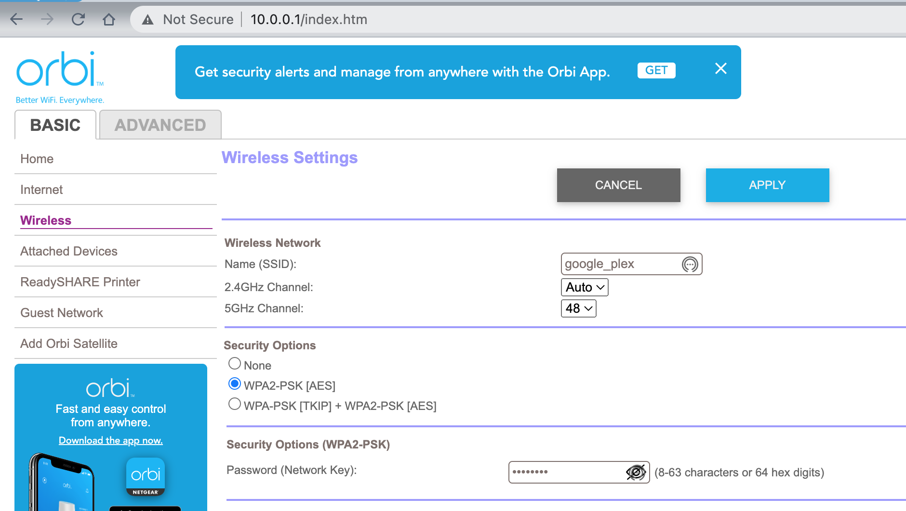

# Router setup

## I. Purpose

 - Work on source control check out
 - create your own tutorial on how to setup your routers

##  II. Clone your personal class repo to your local system

1. You need to use the repo you created in the first assignment and clone it locally.

For example, I created the repo on github for this class as:
https://github.com/pschragger/VU_FALL22_IOT_CLASS

On my local machine I then move my working directory to a place I want to clone my repo with a cd command in a command or term window;
I have created a GitHub folder in my Documents folder so I change to this directory:
'''
 cd /Users/pschragger/Documents/GitHub
'''

2. And now I clone my repo using:
'''
git clone https://github.com/pschragger/VU_FALL22_IOT_CLASS
'''
( This assumes that you have a git package locally ). If you need to install git then follow the tutorial that matches your needs from [https://www.atlassian.com/git/tutorials/install-git](https://www.atlassian.com/git/tutorials/install-git)
Or You can use GitHUb desktop instead. Following
[installing-github-desktop](https://docs.github.com/en/desktop/installing-and-configuring-github-desktop/installing-and-authenticating-to-github-desktop/installing-github-desktop)

3. Once you have cloned your repo locally you need to change directory to the top level folder.  For me that would be

'''
cd VU_FALL22_IOT_CLASS
'''
-or-
'''
cd /Users/pschragger/Documents/GitHub/VU_FALL22_IOT_CLASS
'''

4. Next we need to create a branch to develop on.  Refer to: 
(https://git-scm.com/book/en/v2/Git-Branching-Basic-Branching-and-Merging)

'''
git branch Router_tutorial 
git checkout Router_tutorial
'''

You should see a message that says: Switched to branch 'Router_tutorial'

 You are now ready to create you own tutorial.

##  III. Start creating your own tutorial description how you will setup your router.

1. create the directory
'''
mkdir Setup_Router_Tutorial
'''

2. create a README.md in the new tutorial directory

'''
cd Setup_Router_Tutorial/
'''
edit README.md with a text editor not a document editor.  There must be no extraneous text in the document other than markup language.

You will be using a simple markuplanguage for the file.  The syntax can be found at 
[basic-writing-and-formatting-syntax](https://docs.github.com/en/get-started/writing-on-github/getting-started-with-writing-and-formatting-on-github/basic-writing-and-formatting-syntax)

For the most part you will follow the direction of your router instructions to create a repeater or wifi access point.  Find the instructions in your router packaging or an online version for your router.

Your mission is to document what you did to setup in the README.md file.

You will give your router WIFI ssid a unique name  like:
SSID: IOT_FALL_2022_WIFI_YourIntials
PASSword:  some_password

You will need to remember and use these settings for your projects so they must be unique to you so you do not steal another students wifi bandwidth.

Note: we may have to take turns doing the setup depending on the overlap of wifi frequencies.

## IV. Document your work

Update the README.md in your Setup_Router_Tutorial directory with each step you accomplished.  Take a final image of the setup of your router via a broswer and put the image in a image directory under the Setup_Router_Tutorial

In my case I created an img directory and moved and renamed my image to
Router_setup_image.png

### a. Check in your changes to your tutorial using

Find the files that you modified or added using

'''
git status
'''

then each one use "git add pathname/filename"  to add the changes to the branch

run "git status" again to check the changes are all ready for committing the changes on the branch.

'''
git commit -m "Addding Router Tutorial"
'''

The changes are now committed to you local directory.  You must push the changes to your github.com repo:

'''
git push --set-upstream origin Router_tutorial
'''

### b. Check the changes and edit if necessary

If you make changes be or added files be sure everything is ready for committing by running " git status"
Commit the changes locally with the 'git commit -m "COMMIT MESSAGE"' command
Be sure to push your changes from the local repo to the origin in the github.com repo.

### c. Create a pull request and then merge into your repo
Once finished all your changes then go  to your github repo in cloud and make a pull request to from your Branch back to main.
Then merge the changes to the main branch

### d. Create a release and tag for submission for homework.

